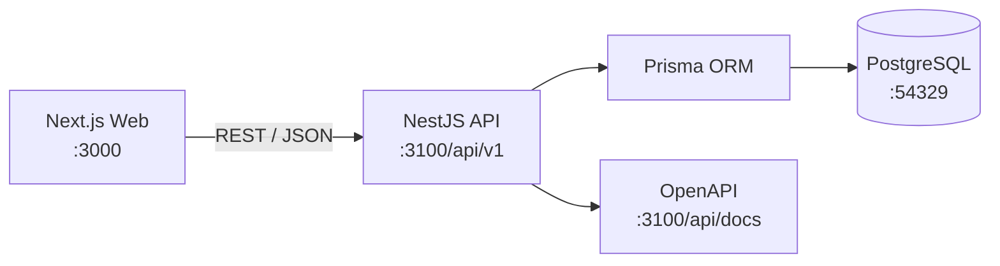

# Nora

面向中央厨房、净配菜工厂与团餐供应链的 AI ERP + MES + WMS 平台。

Nora 以客户订单为业务起点，将需求、BOM、生产、仓储、质量追溯和配送连接为一条可观察、可执行的履约链路。产品界面强调清晰的信息层级、可复用的业务单据和适合现场操作的 MES 交互，而不是传统 ERP 的复杂菜单与表格堆叠。

## 当前版本

仓库目前包含一套高完成度前端 Demo，以及已经接入本地 PostgreSQL 的订单与 BOM 后端 MVP。

已经持久化并通过 REST API 提供的能力：

- 客户与商品基础数据
- 销售订单创建、修改、提交、审核、退回和事件记录
- 乐观锁与服务端订单状态机
- 审核后创建生产需求并保留订单来源快照
- BOM 版本复制、编辑、发布、停用和交期匹配
- 多层 BOM 展开、循环检测、缺失 BOM 提示和物料需求汇总
- OpenAPI 文档、Prisma migrations 和幂等演示数据初始化

Dashboard、生产计划、MES、数字孪生、AI 预测、门户和展厅等页面已具备可交互 Demo；其中尚未接入后端的模块仍使用本地模拟数据，不应视为已完成的生产能力。

## 核心业务链路


当前后端 MVP 覆盖从客户订单到物料需求展开；生产执行、仓储与配送会按独立纵向模块逐步接入。

## 系统架构



前端不直接访问数据库。NestJS Controller 维护 HTTP 契约，Service 编排用例与事务，Policy 保存可独立测试的业务规则，Prisma 负责持久化。

## 技术栈

| 层级 | 技术 |
| --- | --- |
| Web | Next.js 15、React 19、TypeScript、Tailwind CSS 4 |
| UI | Radix UI、Lucide、ECharts、Three.js、React Hook Form、Zod |
| API | NestJS 11、OpenAPI、class-validator |
| 数据 | PostgreSQL 16、Prisma 7 |
| 状态与测试 | Zustand、Vitest |
| 工程 | pnpm workspace、Docker Compose、ESLint |

## 仓库结构

```text
nora/
├── src/                      # Next.js Web 应用
│   ├── app/                  # App Router 页面与布局
│   ├── components/           # 通用 UI、壳层与业务单据组件
│   ├── features/             # 按业务模块组织的前端功能
│   └── lib/                  # Store、类型、API 客户端与领域工具
├── apps/api/                 # NestJS + Prisma 后端
│   ├── prisma/               # Schema、migrations 与 seed
│   └── src/modules/          # Orders、BOM、Catalog 等纵向模块
├── docs/                     # 架构、模块、状态机、运行手册与模板
├── templates/backend-module/ # 新增后端模块的代码模板
├── scripts/                  # Smoke Test 与工程脚本
├── prototype/                # 产品原型参考
├── DESIGN.md                 # UI/UX 设计系统与实现规范
└── ROADMAP.md                # 版本规划
```

## 本地启动

### 环境要求

- Node.js 20 或更高版本
- pnpm 11
- Docker Desktop，或兼容的 Docker Engine 与 Docker Compose

### 首次运行

```bash
cp .env.example .env
pnpm install
pnpm dev:full
```

`dev:full` 会自动完成以下步骤：

1. 启动本地 PostgreSQL 并等待健康检查通过。
2. 应用已提交的 Prisma migrations。
3. 幂等初始化演示组织、客户、商品、订单和 BOM。
4. 并行启动 Next.js 与 NestJS。

启动完成后可访问：

| 服务 | 地址 |
| --- | --- |
| Web | <http://localhost:3000> |
| API | <http://localhost:3100/api/v1> |
| OpenAPI | <http://localhost:3100/api/docs> |
| PostgreSQL | `localhost:54329` |

当 API 不可用时，前端会保留离线 Demo 数据以避免界面完全失效。需要验证真实持久化流程时，请确认 API 与数据库均已启动。

## 常用命令

| 命令 | 说明 |
| --- | --- |
| `pnpm dev:full` | 初始化本地环境并同时启动 Web 与 API |
| `pnpm dev:web` | 仅启动 Next.js |
| `pnpm dev:api` | 仅启动 NestJS |
| `pnpm setup:local` | 启动数据库、应用迁移并初始化演示数据 |
| `pnpm db:up` / `pnpm db:down` | 启动或停止本地 PostgreSQL |
| `pnpm db:migrate -- --name <name>` | 创建开发 migration |
| `pnpm db:deploy` | 应用已提交的 migrations |
| `pnpm db:seed` | 初始化演示数据 |
| `pnpm db:studio` | 打开 Prisma Studio |
| `pnpm typecheck` | 检查 Web 与 API 类型 |
| `pnpm lint` | 运行 ESLint |
| `pnpm test` | 运行 Web 与 API 测试 |
| `pnpm test:smoke` | 对本地订单与 BOM API 执行只读 Smoke Test |
| `pnpm build` | 构建 Web 应用 |
| `pnpm build:api` | 构建 API |

## API MVP 范围

所有业务接口使用 `/api/v1` 前缀。

- `GET /health`：健康检查
- `GET /catalog/customers`、`GET /catalog/products`：订单所需主数据
- `/orders`：订单查询、创建、修改、提交、审核和退回
- `/orders/:id/production-readiness`：生产准备状态
- `/orders/:id/production-demand`：审核后生成的生产需求
- `/orders/:id/material-requirements`：按交期匹配 BOM 并展开物料需求
- `/boms`：BOM 查询与创建
- `/boms/:id/versions`：复制或创建版本
- `/boms/versions/:versionId`：编辑、发布和停用版本

准确的请求、响应与校验规则以本地 OpenAPI 页面为准。

## 关键领域约束

### 订单

- 只有草稿订单可以修改。
- 写操作必须携带 `revision`，避免覆盖其他用户的更新。
- 业务状态变化必须写入事件日志。
- 审核通过、事件写入与生产需求创建在同一个事务中完成。
- 订单行与生产需求行保留商品、价格及来源快照。

### BOM

- 已发布和已停用版本不可直接修改，变更需要复制为新草稿。
- 发布新版本时，同一 BOM 的旧生效版本自动停用。
- 展开时按照订单交期选择当时有效的 BOM 版本。
- 多层展开必须检测循环引用，并显式返回缺失 BOM。
- 数量、价格与成本使用数据库 Decimal，禁止使用浮点数保存业务金额。

## 开发与文档

开始修改代码前，建议按以下顺序阅读：

1. [开发文档入口](docs/README.md)
2. [本地开发手册](docs/runbooks/local-development.md)
3. [订单与 BOM MVP 架构](docs/architecture/order-bom-mvp.md)
4. [订单、生产需求与生产执行关系](docs/architecture/order-demand-production-flow.md)
5. [订单到生产状态机](docs/state-machines/order-to-production.md)
6. [UI/UX 设计系统](DESIGN.md)

模块规范：

- [订单中心](docs/modules/orders/README.md)
- [订单审核策略](docs/modules/orders/order-review-policy.md)
- [BOM](docs/modules/boms/README.md)
- [订单审核页面流](docs/ui-flows/order-review.md)

新增后端模块时使用 [开发指南](docs/guides/create-backend-module.md) 与 [`templates/backend-module`](templates/backend-module/README.md)，并为 Policy、Service、API 和关键前端流程补充相应测试。

## 质量门槛

提交前至少执行：

```bash
pnpm typecheck
pnpm lint
pnpm test
pnpm build
pnpm build:api
```

涉及数据库结构时必须提交 migration；不要用 `prisma db push` 代替可审查的迁移。涉及核心业务流时，应在本地完整环境中补充或执行 `pnpm test:smoke`。

## 规划

当前阶段优先完成订单 → BOM → 生产需求的真实闭环，再逐步接入生产计划、MES、仓储、质量追溯、配送与 AI 排程。完整规划见 [ROADMAP.md](ROADMAP.md)。
