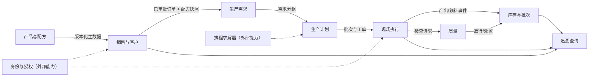

# 限界上下文

## 所有权

| 上下文 | 拥有的事实 | 只读依赖 |
| --- | --- | --- |
| 销售与客户 | 客户、订单、订单状态、审批审计 | 产品可售状态、配方快照服务 |
| 产品与配方 | 产品、单位、配方版本、生效区间 | 无 |
| 生产需求 | 订单派生需求、冻结快照引用 | 已审批订单 |
| 生产计划 | 批次、计划数量、排程确认 | 生产需求、产能日历 |
| 现场执行 | 工单、工序状态、开始/暂停/完成/异常事件 | 已发布计划、作业说明 |
| 库存与批次 | 库存台账、库存批次、库位 | 领料与产出事件 |
| 质量 | 检查、结果、不合格处置、放行 | 批次、工单、检验标准 |
| 追溯 | 跨上下文投影，不拥有源事实 | 所有带因果链的事件 |

## 边界规则

- 不允许前端直接制造跨上下文状态；状态变更由拥有该事实的服务执行。
- 不允许生产计划重新读取当前配方来解释历史订单；必须使用订单审批时快照。
- 数字孪生和驾驶舱是事实的投影，不是事实来源。
