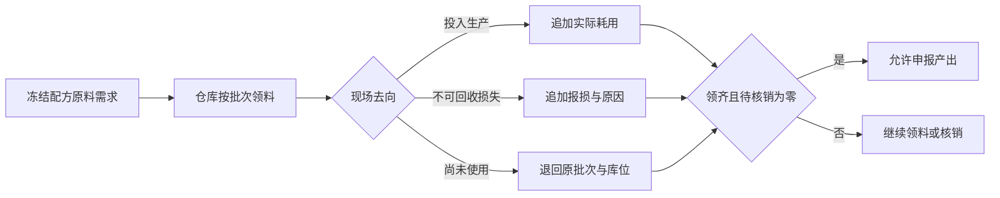

# 工单物料耗用与报损核销流程规格

## 业务结果与范围

- 触发者：仓储人员领退料，现场操作员登记耗用或报损。
- 最终结果：每个已领原料批次都有明确去向，工单满足报产前物料守卫。
- 起点对象与状态：`WorkOrder.running` 且存在已领原料。
- 终点对象与状态：`WorkOrder.running` 且物料完整核销；随后可申报产出。
- 明确不做：工序级投料、核销纠错、返工、离线扫码和成本核算。

## 业务对象与所有权

| 对象 | 回答的问题 | 所属模块 | 创建时机 | 结束条件 |
| --- | --- | --- | --- | --- |
| 领退料流水 | 哪个批次从哪个库位交给或退回了生产 | Inventory | 领料/退料 | 永久追加事实 |
| 物料核销 | 已领批次实际耗用或报损了多少 | Execution | 现场登记 | 永久追加事实 |
| 工单物料投影 | 计划、净领用、耗用、报损和待核销是否一致 | 查询投影 | 读取时计算 | 随追加事实更新 |
| 工单产出 | 是否可进入待检成品批次 | Execution | 守卫通过后报产 | 质量判定结束 |

## 主流程

## 例外与补偿

| 场景 | 是否阻断 | 处理角色 | 状态变化 | 补偿或恢复方式 |
| --- | --- | --- | --- | --- |
| 核销超过已领未核销量 | 是 | 现场操作员 | 不变 | 刷新后按最新余量重填 |
| 退料包含已核销数量 | 是 | 仓储人员 | 不变 | 只退待核销余量 |
| 报损未填原因 | 是 | 现场操作员 | 不变 | 补充真实原因后用原幂等键重试 |
| 工单不在生产中 | 是 | 生产主管 | 不变 | 恢复到合法状态后重新操作 |
| 报产时未领齐或未核销 | 是 | 现场操作员 | 不变 | 返回工单物料完成领料、耗用、报损或退料 |
| 事务并发冲突 | 是 | 当前操作者 | 不变 | 刷新并保留命令幂等键重试 |

## 对象关系与数量基数

- 一张工单可有多条领退料流水和多条核销事实。
- 一条核销事实只绑定一个产品、一个库存批次和一个原领料库位。
- 多次核销允许拆分记录，但累计不得超过同一批次净领用。
- 追溯链：成品库存批次 → 产出 → 工单 → 物料核销 → 原料库存批次；领料流水补充原库位和交接证据。

## 状态定义

物料核销使用追加事实与数量投影，不新增“部分核销”等工单状态。工单保持 `running`，是否可报产由服务端守卫实时计算。

| 对象 | 状态/处置 | 业务含义 | 允许动作 | 禁止动作 |
| --- | --- | --- | --- | --- |
| WorkOrder | `running` | 现场执行中 | 耗用、报损、报产守卫检查 | 超已领核销 |
| MaterialUsage | `consumed` | 原料已投入本工单并不可退 | 查看追溯 | 修改、删除、退料 |
| MaterialUsage | `scrapped` | 原料在本工单中损失且不可退 | 查看原因 | 修改、删除、退料 |
| MaterialProjection | `unaccounted > 0` | 已领原料仍未说明去向 | 继续核销或退料 | 报产 |

## 状态转换契约

| 命令 | 来源状态 | 守卫条件 | 目标状态 | 原子副作用 | 事件/事实 | 执行角色 |
| --- | --- | --- | --- | --- | --- | --- |
| `RecordConsumption` | `running` | 冻结原料、单位一致、数量不超过待核销 | `running` | 追加核销事实 | `WorkOrderMaterialUsage.consumed` | 现场操作员 |
| `RecordScrap` | `running` | 同上且原因必填 | `running` | 追加核销事实 | `WorkOrderMaterialUsage.scrapped` | 现场操作员 |
| `ReturnMaterial` | 合法领退料状态 | 数量不超过扣除核销后的余量 | 不变 | 追加退料流水并增加余额 | `InventoryTransaction.return` | 仓储人员 |
| `ReportOutput` | `running` | 每类原料净领用等于计划且待核销为零 | `awaiting_quality` | 沿用产出与待检批次事务 | `output_reported` | 现场操作员 |

所有写命令要求组织内唯一幂等键。核销与退料先锁定工单并在 Serializable 事务中重新计算余量；失败完整回滚。

## 数据版本与时间语义

- 物料计划只读取工单冻结 v2 配方，递归展开叶子原料并按计划产量缩放。
- 核销发生时间使用服务端时间；数据库保存带时区时间，API 使用本地格式化展示。
- 数量使用三位小数 Decimal，不进行跨单位换算。
- 新配方发布不改变历史工单的计划、核销或报产守卫。

## 自动化与人工边界

| 检查 | 机器是否可确定 | 通过结果 | 失败结果 | 人工角色 |
| --- | --- | --- | --- | --- |
| 是否为冻结叶子原料 | 是 | 允许继续 | `422` 阻断 | 生产主管 |
| 数量是否超过待核销 | 是 | 追加事实 | `409` 阻断 | 现场操作员 |
| 是否发生报损及原因 | 否，由人确认 | 保存真实原因 | 原因缺失时阻断 | 现场操作员/主管 |
| 报产前是否完整核销 | 是 | 允许报产 | `409` 阻断 | 现场操作员 |

- 自动决策策略版本：`material-reconciliation-v1`。
- 自动化总开关：无；production 由身份缺失守卫整体拒绝写入。
- 人工覆盖要求：首版不允许绕过数量和报产守卫。

## 页面任务流

| 用户任务 | 入口 | 主动作 | 成功出口 | 取消/返回 | 独立查看入口 |
| --- | --- | --- | --- | --- | --- |
| 登记物料去向 | 工单行“工单物料” | 选择批次、数量与耗用/报损/退料 | 刷新核销汇总 | 关闭对话框 | 生产工单 |
| 申报产出 | 工单行“产出质检” | 查看核销状态后报产 | 待检产出 | 关闭对话框 | 生产工单 |

## 权限与职责分离

| 角色 | 可执行命令 | 数据范围 | 是否可覆盖规则 |
| --- | --- | --- | --- |
| 现场操作员 | `RecordConsumption`、`RecordScrap` | 当前组织/工位 | 否 |
| 仓储人员 | `IssueMaterial`、`ReturnMaterial` | 当前组织/库位 | 否 |
| 生产主管 | 查看核销与异常 | 当前组织 | 否 |

production 在可信身份与角色策略落地前不开放命令，不由页面角色选择器模拟职责分离。

## 审计与可观测性

- 记录：组织、操作者、工位、设备、工单、产品、批次、库位、处置、数量、单位、原因、幂等键和服务端时间。
- 指标：待核销数量、报损量/率、报产阻断次数和核销耗时后续接入监控。
- 告警：事务连续失败与长时间待核销由后续运维能力实现；当前提供稳定错误和安全重试。

## 验收场景

- [ ] 正常路径从领料到耗用/报损/退料形成守恒数量和批次追溯。
- [ ] 重复提交不产生重复核销事实。
- [ ] 核销与退料并发不会使待核销量为负。
- [ ] 未领齐或未核销时不能报产。
- [ ] 新配方发布后历史核销依据不变。
- [ ] 页面桌面/移动入口、反馈和返回路径符合任务语义。
- [ ] 依赖不可用时没有浏览器本地成功事实。
