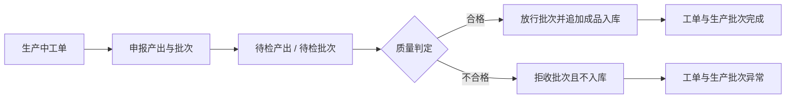

# 工单产出、质量放行与成品入库流程规格

## 业务结果与范围

- 触发者：现场操作员发起报产，质量人员完成判定。
- 最终结果：合格净配菜成品批次可追溯地进入成品库存，工单与生产批次完成。
- 起点对象与状态：`WorkOrder.running`。
- 终点对象与状态：`WorkOrder.completed` 或 `WorkOrder.exception`。
- 明确不做：实际投料、损耗/报废记账、返工路线、让步接收和部分批次累计完工。

## 业务对象与所有权

| 对象 | 回答的问题 | 所属模块 | 创建时机 | 结束条件 |
| --- | --- | --- | --- | --- |
| 工单产出 | 这张工单实际形成了哪个批次、多少数量 | Execution | 现场报产 | 放行或拒收 |
| 质量检查 | 谁按什么标准、样本与测量作出何种判定 | Quality | 质量判定 | 记录后不可变 |
| 库存批次 | 该成品批次当前是否可用 | Inventory | 现场报产 | 后续库存生命周期结束 |
| 库存流水 | 哪次质量放行使多少成品进入哪个库位 | Inventory | 合格放行 | 永久追加事实 |

## 主流程

## 例外与补偿

| 场景 | 是否阻断 | 处理角色 | 状态变化 | 补偿或恢复方式 |
| --- | --- | --- | --- | --- |
| 数量差异未说明 | 是 | 现场操作员 | 不变 | 补充差异原因后用原幂等键重试 |
| 温度超出冻结范围 | 是（对放行） | 质量人员 | `awaiting_quality → exception` | 记录不合格；主管按异常流程决定后续 |
| 库位失效或非成品库 | 是 | 仓储/质量人员 | 不变 | 选择有效成品库后保留幂等键重试 |
| revision 或并发冲突 | 是 | 当前操作者 | 不变 | 刷新后重新判断；不得浏览器假成功 |
| 放行事务失败 | 是 | 当前操作者 | 全部不变 | 保留原幂等键重试 |

## 对象关系与数量基数

- 一张工单可有多条产出历史，但同一时间最多一条 `pending_quality`，且最多一条 `released`。
- 一条产出绑定一个唯一库存批次，可追加多条质量检查历史；首版判定后即终止该产出。
- 合格产出恰好对应一条 `produce/inbound` 库存流水；拒收产出没有入库流水。
- 拒收后主管可恢复工单并申报新批次；旧产出、批次和质量检查继续保留。
- 追溯链：成品库存批次 → 产出 → 工单 → 生产批次 → 冻结配方与来源订单；原料侧先追溯到领料流水，实际投料待后续补齐。

## 状态定义

| 对象 | 状态 | 业务含义 | 允许动作 | 禁止动作 |
| --- | --- | --- | --- | --- |
| WorkOrder | `running` | 现场执行中 | 报产 | 直接完工 |
| WorkOrder | `awaiting_quality` | 已报产，等待判定 | 查看、质量判定 | 新增报产、领料 |
| WorkOrder | `completed` | 合格产出已入库 | 查看追溯 | 状态写入、领退料 |
| WorkOrder | `exception` | 产出不合格或其他异常 | 受控恢复 | 报产、入库 |
| WorkOrderOutput | `pending_quality` | 批次已形成但不可用 | 质量判定 | 入库 |
| WorkOrderOutput | `released` | 合格且已入库 | 查看 | 再次判定 |
| WorkOrderOutput | `rejected` | 不合格且未入库 | 查看 | 放行、覆盖原判定 |

## 状态转换契约

| 命令 | 来源状态 | 守卫条件 | 目标状态 | 原子副作用 | 事件 | 执行角色 |
| --- | --- | --- | --- | --- | --- | --- |
| `ReportOutput` | `running` | revision 一致、无待检/放行产出、批次号唯一、单位一致、差异有原因 | `awaiting_quality` | 创建产出和待检批次；同步生产批次 | `output_reported` | 现场操作员 |
| `ReleaseOutput` | `awaiting_quality` | 产出待检、全部检查通过、温度合规、成品库有效、revision 一致 | `completed` | 追加质量检查；放行批次；追加流水与余额；完成批次 | `completed` | 质量人员 |
| `RejectOutput` | `awaiting_quality` | 产出待检、至少一项不合格或有拒收说明、revision 一致 | `exception` | 追加质量检查；拒收批次；同步批次异常 | `quality_rejected` | 质量人员 |

每个命令都要求组织内唯一 `Idempotency-Key`；重复命令返回同一结果。工单、产出、批次与余额使用行锁/乐观锁，事务失败完整回滚。

## 数据版本与时间语义

- 业务解析时点：报产和质量判定均使用服务端时间。
- 冻结依据：工单已冻结完整 v2 配方；报产时把末道工序温度上下限复制到产出记录。
- 历史回放：质量判定只读取产出保存的温度范围，不读取最新 BOM。
- 时区与舍入：数据库保存带时区时间；数量三位小数、温度两位小数，API 使用字符串。

## 自动化与人工边界

| 检查 | 机器是否可确定 | 通过结果 | 失败结果 | 人工角色 |
| --- | --- | --- | --- | --- |
| 工单/批次状态与 revision | 是 | 接受命令 | `409` 阻断 | 生产主管 |
| 数量单位与差异原因 | 是 | 创建待检产出 | `400/422` 阻断 | 现场操作员 |
| 实测温度是否在冻结范围 | 是 | 允许选择放行 | 放行被阻断，可拒收 | 质量人员 |
| 外观、封口与标签 | 否，由人检查 | 人工勾选通过 | 不允许放行 | 质量人员 |
| 最终质量判定 | 否 | 放行或拒收 | 无自动判定 | 质量人员 |

- 自动决策策略版本：`output-quality-v1`。
- 自动化总开关：无；首版不自动放行。
- 人工覆盖要求：首版不允许覆盖温度与检查项守卫，不支持让步接收。

## 页面任务流

| 用户任务 | 入口 | 主动作 | 成功出口 | 取消/返回 | 独立查看入口 |
| --- | --- | --- | --- | --- | --- |
| 申报产出 | 生产工单行 | 填写实际数量、批次与有效期 | 待检详情 | 关闭对话框 | 生产工单 |
| 质量判定 | 待检工单行 | 记录标准、抽样、温度与检查项 | 完成/异常详情 | 关闭对话框 | 生产工单 |
| 查看入库 | 放行结果 | 前往成品库存 | 成品库存 | 生产工单 | 成品库存 |

## 权限与职责分离

| 角色 | 可执行命令 | 数据范围 | 是否可覆盖规则 |
| --- | --- | --- | --- |
| 现场操作员 | `ReportOutput` | 当前组织/工位 | 否 |
| 质量人员 | `ReleaseOutput`、`RejectOutput` | 当前组织/工厂 | 否 |
| 生产主管 | 查看、异常恢复 | 当前组织 | 否 |

production 在身份与角色策略落地前不开放命令，避免由前端角色选择器冒充职责分离。

## 审计与可观测性

- 记录：组织、操作者、工位、设备、标准版本、样本、测量、判定、revision、幂等键和服务端时间。
- 指标：待检积压、合格率、拒收率、实际/计划差异、报产到判定时长（后续接入监控）。
- 告警：事务连续失败或待检超时由后续运维能力实现；当前 API 返回稳定错误并保留可重试语义。

## 验收场景

- [ ] 正常主路径产生完整产出、检查、批次、流水、余额和完工事实。
- [ ] 不合格进入异常且无库存余额。
- [ ] 重复提交不产生重复下游对象。
- [ ] 事务失败不留下部分状态。
- [ ] 新配方发布后历史产出的温度依据不变。
- [ ] 页面入口、结果和返回路径符合角色任务。
- [ ] 依赖不可用时没有部分写入或浏览器假成功。
