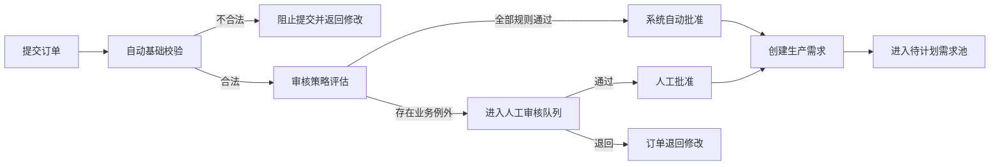

# 订单审核策略

## 目标

在销售订单转化为生产需求之前，确认客户承诺有效，并把需要业务判断的例外路由给正确角色。审核不是生产排程，也不决定订单如何合批或拆批。

架构决策见 [ADR-0001](../../decisions/0001-hybrid-order-approval.md)。

## 审核流程



## 决策规则

规则分为三类，不能只返回一个布尔值：

| 规则类型 | 示例 | 失败结果 |
| --- | --- | --- |
| 硬校验 | 客户存在、订单至少一行、数量为正、商品有效、交期格式正确 | `blocked` |
| 自动放行条件 | 可信客户、标准商品与价格、交期满足最小提前期、数量和金额未超阈值、无特殊说明、BOM 已就绪 | 任一未满足则 `manual_review` |
| 生产阻断 | 缺少有效 BOM、工艺或食品安全资料 | 可人工批准客户需求，但生产需求不得进入计划 |

组织级策略至少需要以下配置，具体数值不得硬编码在页面：

- `auto_approval_enabled`
- `auto_approval_max_amount`
- `auto_approval_max_line_quantity`
- `minimum_delivery_lead_time_hours`
- `trusted_customer_required`
- `manual_review_sources`
- `require_bom_for_auto_approval`

## 建议的例外路由

| 例外原因 | 默认处理角色 | 是否允许覆盖 |
| --- | --- | --- |
| 新客户或客户未进入可信名单 | 订单运营 | 是 |
| 非标准价格、合同或信用条件 | 销售主管 | 是，必须填写原因 |
| Excel 导入、AI 预测来源 | 订单运营 | 是 |
| 数量或金额超过自动阈值 | 销售主管 | 是 |
| 交期短于最小提前期 | 订单运营 + 生产计划员 | 是，必须确认交期 |
| 缺少有效 BOM | 订单运营 + 生产计划员 | 可确认需求，不得进入计划 |
| 特殊包装、标签、过敏原或隔离要求 | 订单运营 | 是，必须保留说明 |
| 客户、商品或数量不合法 | 提交人 | 否，必须修正 |

## 审核结果契约

策略评估需要形成可持久化结果：

```ts
type OrderReviewOutcome = "blocked" | "manual_review" | "auto_approve";

type OrderReviewEvaluation = {
  orderId: string;
  orderRevision: number;
  outcome: OrderReviewOutcome;
  policyVersion: string;
  reasonCodes: string[];
  evaluatedAt: string;
};
```

后续数据模型应保存：

- 订单版本和策略版本。
- 自动评估结果与结构化原因代码。
- 批准方式：`automatic` 或 `manual`。
- 人工决定人、执行角色、意见和时间。
- 覆盖了哪些规则以及覆盖原因。

## 状态转换

| 命令 | 来源状态 | 策略结果 | 目标状态 | 副作用 |
| --- | --- | --- | --- | --- |
| 提交订单 | `draft` | `blocked` | `draft` | 返回结构化错误，不创建需求 |
| 提交订单 | `draft` | `manual_review` | `pending` | 写入待人工审核事件和原因 |
| 提交订单 | `draft` | `auto_approve` | `approved` | 记录系统批准并创建生产需求 |
| 人工批准 | `pending` | 人工通过 | `approved` | 记录审核人并创建生产需求 |
| 退回修改 | `pending` | 人工退回 | `draft` | 记录必填意见，不创建需求 |

自动和人工批准必须满足：

- 使用订单 `revision` 防止旧版本被批准。
- 同一订单只能创建一张生产需求。
- 状态、事件和生产需求在一个事务中提交。
- 重试不得重复创建事件或生产需求。

## 页面任务流

- 审核入口：`/orders/approvals`。
- 审核页左上角返回：订单审核列表。
- 订单详情是独立查看入口，不承担审核任务的返回目标。
- 人工处理成功后返回审核列表，并显示订单、结果和生产需求编号。
- 审核列表未来只展示需要人工判断的订单，并直接显示原因代码、风险等级和建议角色。

## 当前实现差距

- 已接 production OIDC 身份和 `orders:approve` 服务端权限；审批代理、临时授权和更细粒度职责分离尚未实现。
- 尚无审核策略表、评估记录和组织级阈值。
- 当前所有 `pending` 订单都需要人工点击。
- 当前批准事件以显示名称记录操作人，尚未保存稳定用户 ID 和执行角色。
- 当前缺少审核完成后的列表级结果提示。
