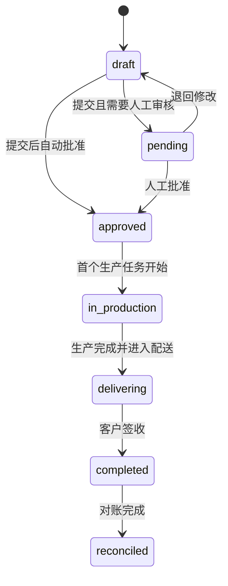
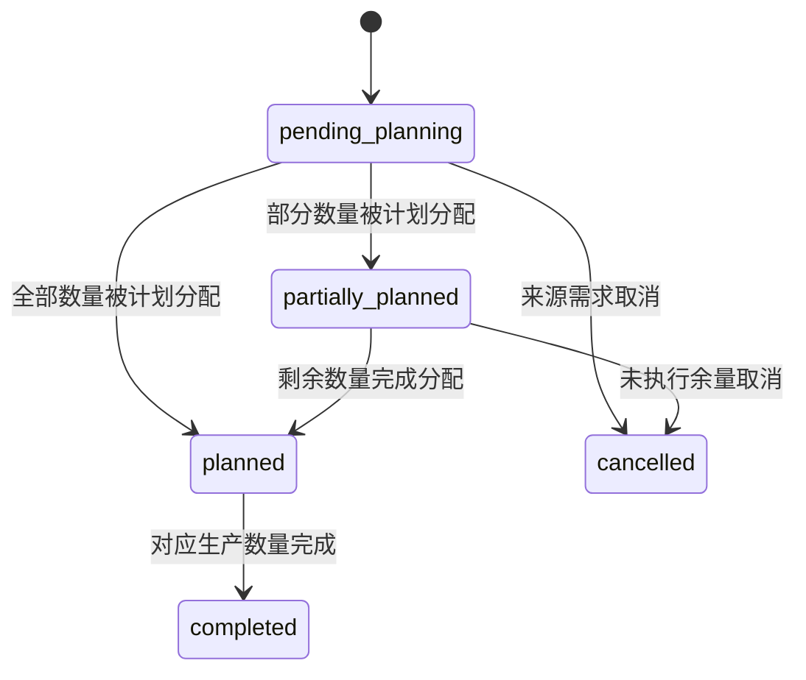

# 订单到生产状态机

## 设计原则

状态描述业务对象的生命周期；异常、风险、进度和页面位置不能混入状态字段。跨对象联动必须由明确命令完成，禁止前端直接修改状态。

## 销售订单



`pending` 只表示等待人工业务决定。系统自动批准时不需要为了表现“走过审核”而短暂停留在该状态，审核轨迹由事件和评估记录证明。

## 生产需求



生产需求状态必须由分配数量和执行结果驱动。`partially_planned` 等进度可以先通过数量推导，只有在需要查询性能或业务冻结时才冗余持久化。

## 生产计划与工单边界

生产计划模块尚未实现，目标关系为：

```text
生产需求行 ← 需求分配（allocated_quantity）→ 生产计划项 → 生产工单
```

该分配表支持：

- 多张订单的需求行合并到一个生产计划项。
- 一条订单需求拆到多个日期、班次或批次。
- 任何工单向上追溯到订单、客户和分配数量。

## 关键转换契约

| 命令 | 前置状态 | 守卫条件 | 原子副作用 | 执行者 |
| --- | --- | --- | --- | --- |
| 提交订单 | `draft` | 订单基础数据合法 | 保存评估结果；进入待审核或自动批准 | 提交人 + 系统策略 |
| 批准订单 | `pending`，或自动批准路径中的 `draft` | revision 未变化；策略允许 | 订单批准、事件、生产需求和需求行 | 订单运营 / 销售主管 / 系统 |
| 退回订单 | `pending` | 意见非空 | 回到草稿并记录原因 | 订单运营 / 销售主管 |
| 分配需求 | `pending_planning` / `partially_planned` | 可分配量充足；工厂、BOM、单位兼容 | 写入数量分配并更新需求进度 | 生产计划员 |
| 下达工单 | 已确认生产计划 | BOM、工艺、产线和班次完整 | 创建工单和来源分配快照 | 生产计划员 |

## 不变量

- 一张销售订单当前只能生成一张生产需求。
- 一条销售订单行当前只能生成一条原始生产需求行。
- 批准重试不能重复创建生产需求。
- 已批准订单的商业内容不能原地修改；未来必须通过版本或变更单处理。
- 生产计划只能消费可分配数量，累计分配不得超过需求数量。
- 合批和拆批后仍必须保留订单来源数量。
- 缺少 BOM 的需求可以存在，但不得下达生产工单。

## 不属于状态的内容

以下内容应使用独立字段或实时计算：

- BOM 是否就绪。
- 客户信用、交期、价格和数量风险。
- 审核策略结果及原因。
- 履约完成百分比。
- 页面当前步骤和返回地址。
