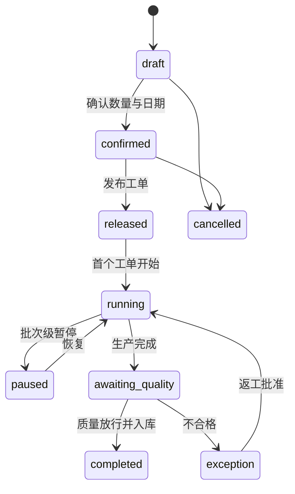

# 生产批次状态机

批次必须引用来源生产需求分配与所用配方快照。状态由工单、质量和库存事件聚合，不允许数字孪生页面成为状态来源。

当前代码已实现 `CreateProductionBatch → draft → confirmed → released`。`released` 在同一事务内创建一张引用冻结 v2 配方快照的 `WorkOrder.pending`；`running` 及之后仍未实现。

确认和释放都要求 `Idempotency-Key` 与客户端最后读取到的 `revision`。跳过状态、过期 revision、跨组织对象和不完整/v1 工艺快照均失败关闭。
