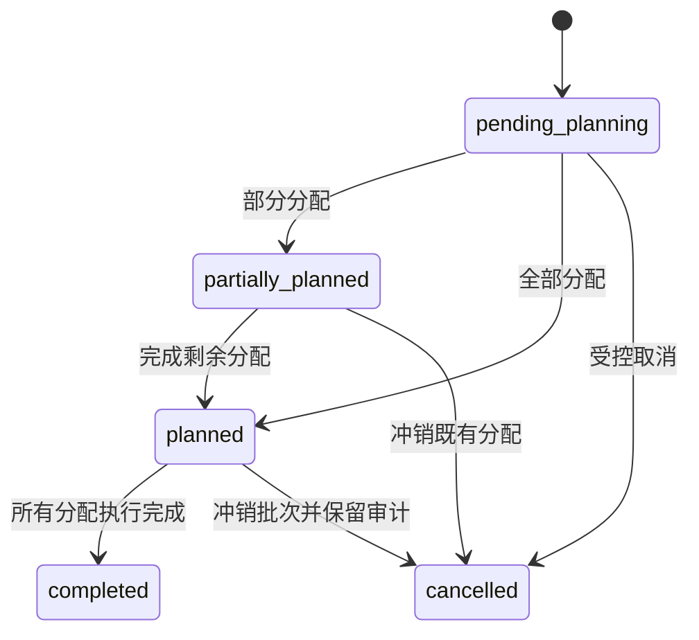

# 生产需求状态机

- `pending_planning`：由已审批订单在同一事务中生成，配方快照完整，尚未分配生产批次。
- `partially_planned`：部分数量已分配；来源、已分配量和剩余量必须可核对。
- `planned`：全部数量已分配到批次，但仍需保留每笔来源分配关系。
- `completed`：只由执行事实聚合产生，不由看板按钮直接设置。
- `cancelled`：保留原需求、原因、操作者和冲销关系。

当前代码已经通过 `CreateProductionBatch` 实现 `pending_planning → partially_planned | planned`，并在同一事务内写入来源分配和 `allocation_changed` 审计事件。取消、执行完成和冲销仍未实现；这些状态不得由页面或演示数据直接改写。
