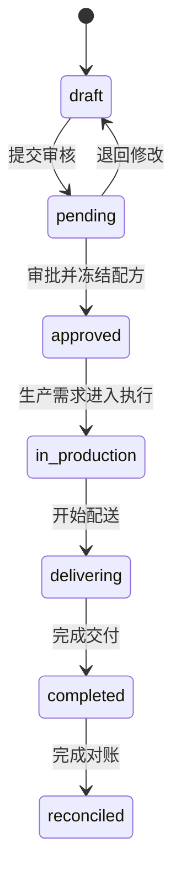

# 销售订单状态机

| 转换 | 前置条件 | 原子副作用 | 禁止 |
| --- | --- | --- | --- |
| `draft → pending` | 行项目和交付信息有效 | 记录提交审计 | 缺产品/数量仍提交 |
| `pending → approved` | 所有产品存在交付时点有效配方 | 冻结递归快照、创建唯一生产需求、记录审批人 | 部分成功、重复需求 |
| `approved → in_production` | 需求已确认并生成批次 | 绑定计划/批次 | 前端直接改状态 |
| `in_production → delivering → completed` | 生产、质量和配送事实完整 | 记录交付审计 | 用演示事件跳过执行事实 |
| `completed → reconciled` | 差异和结算依据已确认 | 记录对账审计 | 浏览器本地直接改正式状态 |

代码枚举当前使用 `pending` 表示“已提交、待审核”，不要在契约或新代码中另造 `submitted` 状态。取消/冲销尚未进入当前 Prisma 枚举和服务端状态机，不得仅在前端添加。

审批接口必须幂等：已审批且已有生产需求时返回已有结果。
