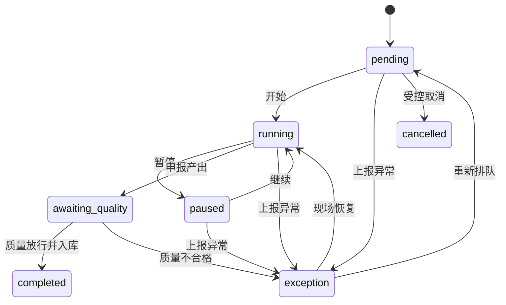

# 工单状态机

## 事件要求

每次转换记录：工单、前后状态、真实操作者、设备/工位、服务端时间、原因（适用时）、数量（适用时）和幂等键。生产模式拒绝匿名或演示身份。暂停、上报异常和异常恢复必须记录原因或处置说明。

## 当前实现

批次从 `confirmed` 释放时原子创建一张 `WorkOrder.pending` 和 `WorkOrderEvent.created`，并复制批次冻结的商品、数量、单位、计划时间、BOM 版本和完整 v2 配方快照。

当前已实现现场状态控制、工单领退料、工单级实际耗用/报损核销和首个产出质量闭环。物料核销不新增工单状态；`running → awaiting_quality` 前由服务端确认每类冻结叶子原料已领齐且待核销量为零，随后创建待检产出与待检成品批次但不增加库存。质量放行在一个事务中追加检查、放行批次、成品入库并转为 `completed`，不合格转为 `exception` 且不入库。工序级投料、库存报废处置、返工路线和让步接收仍未实现；production 在可信身份与职责权限接入前继续拒绝写入。

## 现场体验

MES 端仅突出开始、暂停、继续、完成和异常上报；扫码用于定位真实工单/批次，不把“模拟扫码”结果写入生产事实。
