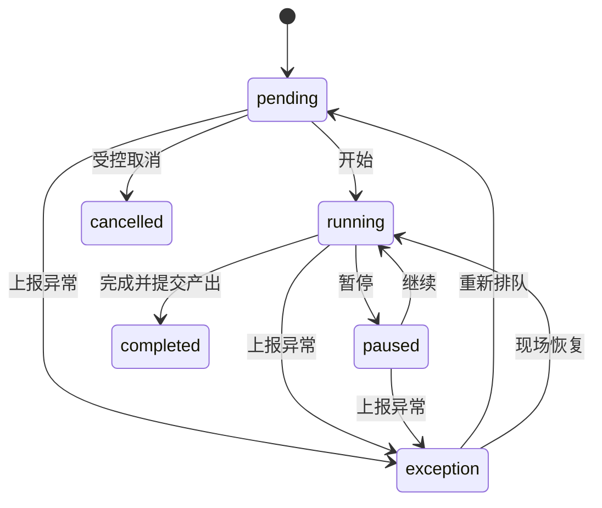

# 工单状态机

## 事件要求

每次转换记录：工单、前后状态、真实操作者、设备/工位、服务端时间、原因（适用时）、数量（适用时）和幂等键。生产模式拒绝匿名或演示身份。暂停、上报异常和异常恢复必须记录原因或处置说明。

## 当前实现

批次从 `confirmed` 释放时原子创建一张 `WorkOrder.pending` 和 `WorkOrderEvent.created`，并复制批次冻结的商品、数量、单位、计划时间、BOM 版本和完整 v2 配方快照。

首个现场控制切片实现 `pending → running → paused → running`、异常上报和异常恢复。每次命令原子同步生产批次投影并追加两边审计事件；development 可走真实 API，production 在可信身份接入前失败关闭。实际领料、产出、完工和质量仍未实现。

## 现场体验

MES 端仅突出开始、暂停、继续、完成和异常上报；扫码用于定位真实工单/批次，不把“模拟扫码”结果写入生产事实。
