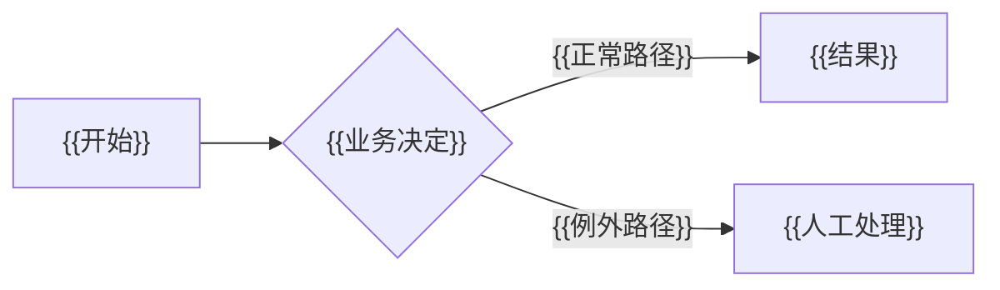

# {{工作流名称}}流程规格

## 业务结果与范围

- 触发者：{{谁发起流程}}
- 最终结果：{{最终用户获得的业务结果}}
- 起点对象与状态：`{{object}}.{{state}}`
- 终点对象与状态：`{{object}}.{{state}}`
- 明确不做：{{本次不覆盖的下游能力}}

## 业务对象与所有权

| 对象 | 回答的问题 | 所属模块 | 创建时机 | 结束条件 |
| --- | --- | --- | --- | --- |
| {{对象}} | {{业务问题}} | {{模块}} | {{事件}} | {{条件}} |

## 主流程

## 例外与补偿

| 场景 | 是否阻断 | 处理角色 | 状态变化 | 补偿或恢复方式 |
| --- | --- | --- | --- | --- |
| {{例外}} | {{是/否}} | {{角色}} | `{{from}} → {{to}}` | {{方式}} |

## 对象关系与数量基数

- `{{对象 A}}` 与 `{{对象 B}}`：{{一对一 / 一对多 / 多对多}}。
- 合并规则：{{何时允许多个来源合并}}。
- 拆分规则：{{何时允许一个来源拆分}}。
- 追溯要求：{{如何保留来源、数量与版本}}。

## 状态定义

| 对象 | 状态 | 业务含义 | 允许动作 | 禁止动作 |
| --- | --- | --- | --- | --- |
| {{对象}} | `{{状态}}` | {{含义}} | {{动作}} | {{动作}} |

不要把风险、进度、页面步骤或临时错误定义成业务状态。

## 状态转换契约

| 命令 | 来源状态 | 守卫条件 | 目标状态 | 原子副作用 | 事件 | 执行角色 |
| --- | --- | --- | --- | --- | --- | --- |
| {{命令}} | `{{from}}` | {{条件}} | `{{to}}` | {{写入内容}} | `{{event}}` | {{角色}} |

每个转换还必须定义：幂等键、乐观锁、失败回滚、重试行为和稳定错误码。

## 自动化与人工边界

| 检查 | 机器是否可确定 | 通过结果 | 失败结果 | 人工角色 |
| --- | --- | --- | --- | --- |
| {{规则}} | {{是/否}} | {{动作}} | {{阻断/进入例外队列}} | {{角色}} |

- 自动决策策略版本：`{{policy_version}}`
- 自动化总开关：`{{config_key}}`
- 人工覆盖要求：{{权限与必填原因}}

## 页面任务流

| 用户任务 | 入口 | 主动作 | 成功出口 | 取消/返回 | 独立查看入口 |
| --- | --- | --- | --- | --- | --- |
| {{任务}} | `{{route}}` | {{动作}} | `{{route}}` | `{{route}}` | `{{route}}` |

## 权限与职责分离

| 角色 | 可执行命令 | 数据范围 | 是否可覆盖规则 |
| --- | --- | --- | --- |
| {{角色}} | {{命令}} | {{范围}} | {{是/否}} |

## 审计与可观测性

- 记录：操作者 ID、执行角色、策略版本、原因代码、对象 revision、时间和备注。
- 指标：自动通过率、人工审核率、退回率、平均审核时长、规则命中分布。
- 告警：{{事务失败、积压或异常阈值}}。

## 验收场景

- [ ] 正常主路径产生完整业务结果。
- [ ] 每个例外进入正确角色的队列。
- [ ] 重复提交不产生重复下游对象。
- [ ] 事务失败不留下部分状态。
- [ ] 合并或拆分后仍能追溯来源数量。
- [ ] 页面入口、成功出口和返回目标符合任务语义。
- [ ] 操作记录能够解释人工和自动决定。
